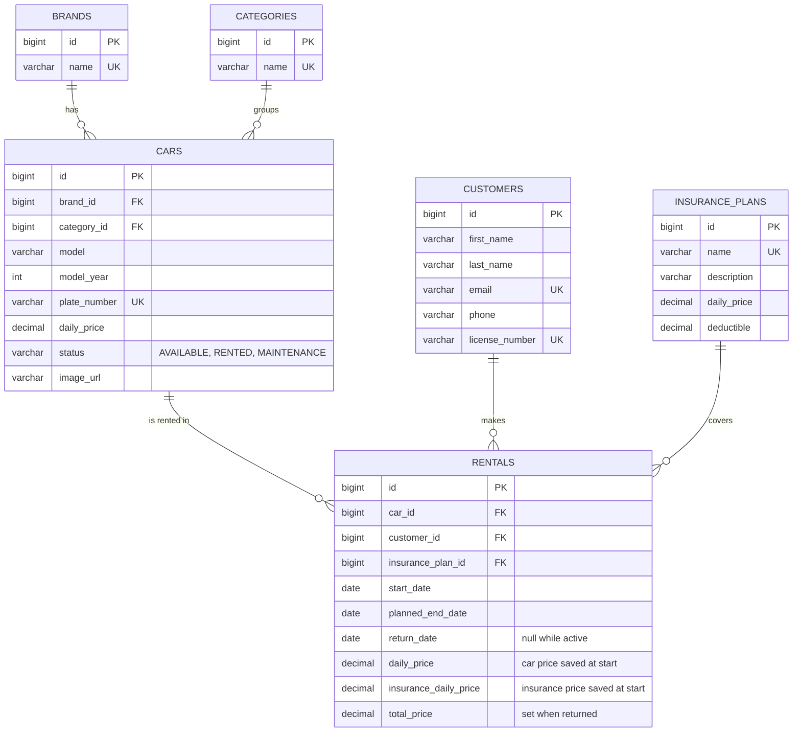

# ER diagram (version 3.0)

## Notes

- A rental is **active** while `return_date` is empty; it is **overdue** when it is active and `planned_end_date` has passed.
- `total_price = days x (daily_price + insurance_daily_price)`, minimum 1 day.
- Prices are copied into the rental when it starts, so later price changes do not change old rentals.
- `model_year` is used as the column name because `YEAR` is a reserved word in H2.
- `image_url` is optional; the desktop app downloads the photo once and caches it in `~/CarRentalData/images`.
