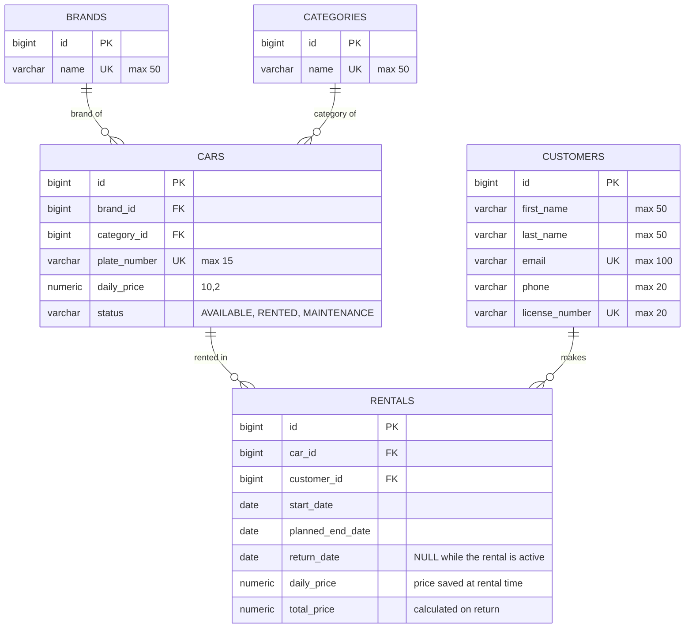

# Car Rental System – ER Diagram

The database has five tables. Hibernate creates them automatically from the entity classes in `src/main/java/hu/nye/carrental/model`.

## Relationships

| Relationship | Type | Meaning |
| --- | --- | --- |
| Brand – Car | 1 : N | A brand can have many cars; every car has exactly one brand |
| Category – Car | 1 : N | A category can have many cars; every car has exactly one category |
| Car – Rental | 1 : N | A car can be rented many times over time, but has at most one active rental (`return_date` is NULL) |
| Customer – Rental | 1 : N | A customer can have many rentals; every rental belongs to exactly one customer |

## Constraints

- **Primary keys:** every table has an auto-generated `id`.
- **Foreign keys:** `cars.brand_id`, `cars.category_id`, `rentals.car_id`, `rentals.customer_id`. Because of them, a brand, category, car or customer that is still referenced cannot be deleted.
- **Unique:** `brands.name`, `categories.name`, `cars.plate_number`, `customers.email`, `customers.license_number`.
- **Not null:** every column except `rentals.return_date` and `rentals.total_price`, which are filled when the car is returned.
